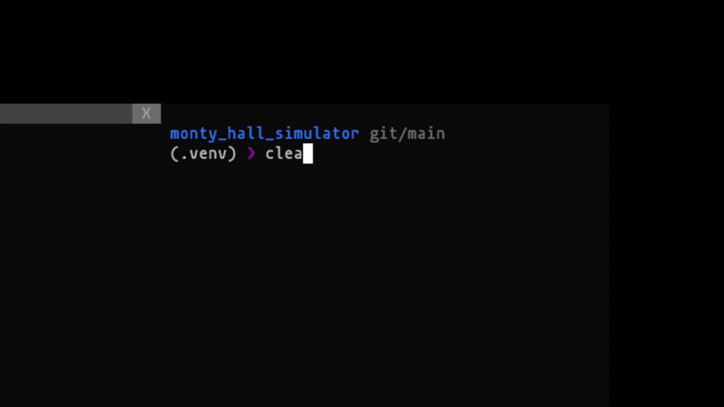

# Monty Hall Problem Simulator

This is a simple [Monty Hall](https://en.wikipedia.org/wiki/Monty_Hall_problem) simulator.



## Usage

You must have [Poetry](https://python-poetry.org/) installed.

```bash
poetry install
poetry run python src/main.py
```
